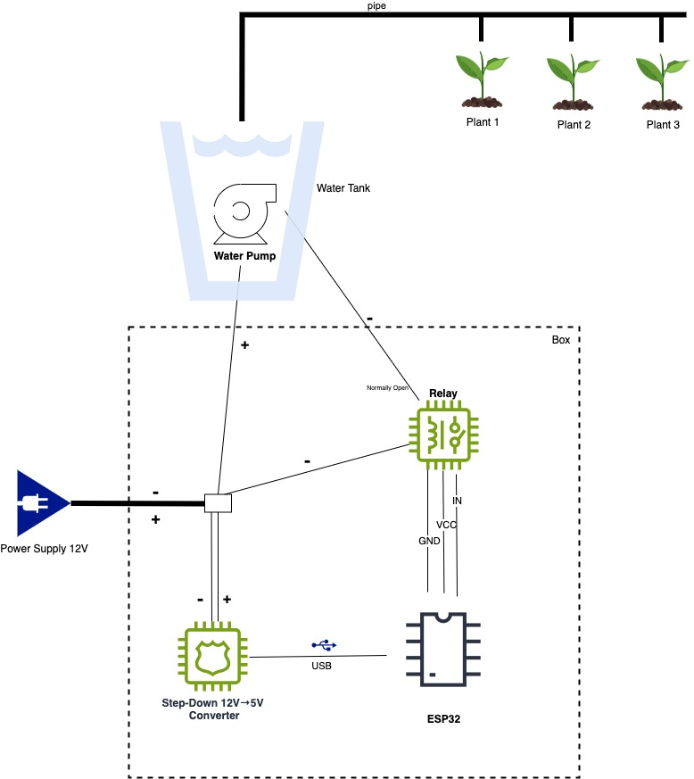
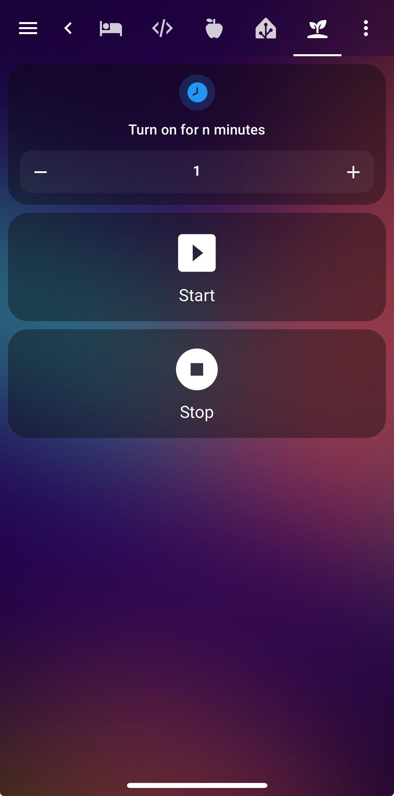

---

# 🌱 Smart Balcony Irrigation System (ESP32 + Home Assistant + ESPHome)

**An IoT-powered Smart Home project** that automates plant watering on your balcony using an ESP32 microcontroller, a 12 V water pump, and seamless integration with **Home Assistant** through **ESPHome**.
This project combines hardware tinkering and software automation, showcasing my passion for  **IoT**, and **cloud-ready Smart Home architectures**.

---

## ✨ Project Overview

This system allows you to:

* Automatically water your balcony plants at scheduled times (e.g., morning and evening).
* Manually start and stop irrigation from a **Home Assistant Lovelace dashboard** with dynamic controls (+/– minutes, start/stop buttons).
* Trigger irrigation through an **NFC tag** and choose custom watering duration.
* Integrate easily with other **Smart Home** devices or voice assistants.

All configurations (YAML files, ESPHome scripts, and Home Assistant automations) are version-controlled and shared in this repository.

---

## 📦 Components Used

* **ESP32 Development Board** (IoT microcontroller with Wi‑Fi)
* **12 V submersible water pump** (Durable 280 L/H, 300 cm lift)
* **12 V power supply (adapter)**
* **Step-down converter (12 V → 5 V with USB output)** to power the ESP32 without using other cables
* **Relay module** (to switch the pump on/off)
* **Tubing and drip emitters** for irrigation
* **End caps** to close off tubing
* Various wiring (1.5 mm² for power, jumper wires for signal connections)

I will link each component in the repository with purchase details.

---

## 🔌 Wiring Diagram

I’ve included:

* A **schematic** with all connections (ESP32 ↔ Relay ↔ Pump ↔ Step-down).


**Key Points:**

* 12 V power supply feeds both the pump (through the relay) and the step-down converter.
* The relay switches the GND line to control the pump.
* All grounds (ESP32, relay, pump) are tied together for a common reference.

---

Below is a detailed explanation of how all components are connected and why each connection is necessary.
The system uses a 12 V power supply for the pump and steps down the voltage to 5 V for the ESP32 and relay module, ensuring both devices share a common ground for proper switching.

✅ From the 12 V Power Supply
12 V (+) → goes to:

- Pump (+) (to power the pump’s motor).

- Step-down converter VIN (+) (to provide 5 V output for ESP32 and relay).

12 V (GND) → goes to:

- Relay COM terminal (this ground will be switched to the pump by the relay).

- Step-down converter GND (this creates a common ground for the low‑voltage circuit).

Why:
We need to provide 12 V to the pump motor and also feed a step-down converter to get 5 V for the ESP32 and relay. The ground (GND) is shared so the relay control signal can properly switch the pump’s ground.

✅ Step-Down Converter (12 V → 5 V with USB output)
- VIN (+) from power supply 12 V.

- GND from power supply 12 V.

- 5 V Output (via USB) powers the ESP32 (connected through its USB port).

Optionally, the relay module VCC (5 V) can also be powered by this output (if not powered by the ESP32 5 V pin).

Why:
ESP32 works at 5 V (via its onboard regulator when powered by USB). The step-down provides a stable low-voltage supply derived from the same 12 V input, ensuring a single shared supply.

✅ Relay Module Inputs
- VCC → connected to 5 V from ESP32 (or from step-down 5 V output).

- GND → connected to GND of ESP32 (and thus to step-down GND and power supply GND).

- IN → connected to a GPIO pin of ESP32 (e.g., GPIO5).

Why:
The relay needs a 5 V power supply for its coil and a control signal from the ESP32 to switch on/off. Sharing ground ensures the logic signal can reference the same 0 V.

✅ Relay Module Outputs
- COM (Common) → connected to the 12 V Ground (GND) from the power supply.

- NO (Normally Open) → connected to the pump GND wire.

- NC (Normally Closed) → left unconnected.

Why:
When the relay is off, the circuit between COM and NO is open, so the pump has no return path to ground and stays off.
When the relay is on, COM and NO are connected internally, completing the ground circuit for the pump and making it run.

✅ Pump
Pump (+) → directly to the 12 V positive from the power supply.

Pump (–) → to the relay’s NO terminal.

Why:
The pump always has a 12 V positive supply, but its ground is switched by the relay. This allows the ESP32 to control when the pump is active without handling high current directly.

📌 Summary (Bullet Points)
- 12 V (+) → Pump (+) and Step-down VIN (+)

- 12 V (GND) → Relay COM and Step-down GND

- Step-down 5 V → ESP32 (via USB) and Relay VCC

- Step-down GND → ESP32 GND and Relay GND

- ESP32 GPIO (e.g., GPIO5) → Relay IN

- Relay NO → Pump (–)

- Relay COM → 12 V GND

- Relay NC → Not connected


## 🏗️ Software Architecture

This project uses:

* **ESPHome** on the ESP32 for direct integration with Home Assistant.
* **Home Assistant Automations** to handle scheduled tasks and dynamic watering duration.

### 📂 Repository Contents

```
/esphome
  waterplants.yml                # ESPHome configuration for the ESP32
/homeassistant
  waterPlantsNFCTag.yml          # HA automations for scheduled watering
  waterPlantsTimeAutomation.yml  # HA Lovelace configuration for UI
  scripts.yml                    # Scripts for defining irrigation time 
  lovelace.yml                   # Dashboard (see the phone screenshot)
/images
  finished_project.jpg           # Photos of the assembled system
  wiring_diagram.jpg
  lovelace.jpeg
```

---

## ⚡ Home Assistant Integration

* Add the ESPHome device (`waterplants.local`) via **ESPHome integration**.
* Automations schedule the pump to run:

  * Every morning at 06:00 for X minutes
  * Every evening at 20:00 for X minutes
* Lovelace dashboard offers:

  * `+` and `–` buttons to adjust watering time dynamically (`input_number.watering_time`)
  * A **Start Watering** button that respects the selected time
  * A **Stop** button to immediately turn off the pump

<div align="center"></div>

---

## 🚀 Advanced Features

* **IoT-friendly:** can be extended with sensors (e.g., soil moisture, temperature) for fully automated watering logic.
* **Cloud-ready:** integrates with Home Assistant’s remote access (via Nabu Casa or your own setup).
* **DevOps mindset:** all configs are in YAML and easily deployed/updated. Perfect for CI/CD pipelines managing multiple IoT devices.

---

## 🔧 How to Reproduce

1. Wire up the components as shown in the wiring diagram.
2. Flash the ESP32 with `esphome waterplants.yml`.
3. Add the device to your Home Assistant instance via **ESPHome Integration**.
4. Import `automations` and `lovelace` yaml scripts to your HA configuration.
5. Enjoy your **Smart Balcony Irrigation System**!

---

## 💡 Why This Project?

I built this to explore:

* **IoT development** with ESP32
* **Home automation** through ESPHome and Home Assistant
* **Smart Home hardware/software integration**

It demonstrates how to take an idea from **hardware prototyping** to a **production-ready smart solution**.

---

## Enjoy!  🚀
